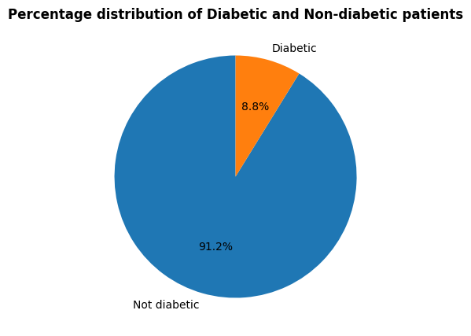
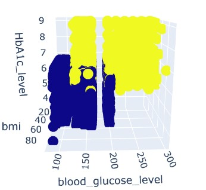
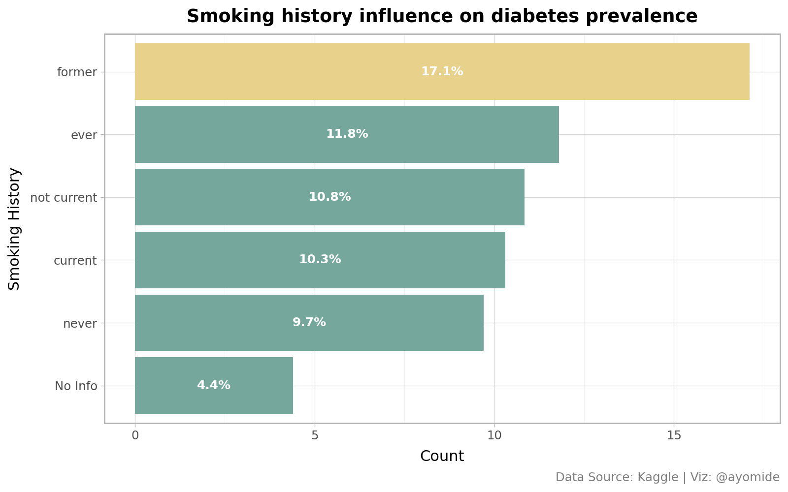
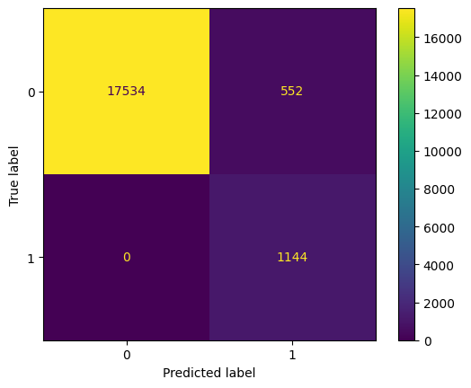

#  Diabetes Probability Prediction

## &#128279; Project Overview
This project applies supervised machine learning techniques to predict the probability that a patient will be diagnosed with diabetes.
These multiple models learn patterns that distinguish patients into predefined labels (e.g., 'diabetes', 'non-diabetes') and predicts the probability of a patient diagnosed with diabetes. 

## &#128279; Authors
* Ayomide Olatunde

## &#128279; Table of Contents
* [Authors](#-authors)
* [Table of Contents](#-table-of-contents)
* [Dataset Description](#-dataset-description)
* [Tools & Libraries Used](#-tools--libraries-used)
* [Workflow Implemented](#-workflow-implemented)
* [Exploratory Data Analysis](#-exploratory-data-analysis)
* [Model Performance](#-model-performance)
* [Key Insights](#-key-insights)
* [Visualizations](#-visualizations)
* [Learning Outcomes](#-learning-outcomes)
* [How to Run the project](#-how-to-run-the-project)
* [Repository Structure](#-repository-structure)
* [License](#-license)
* [Contact](#-contact)


## &#128194; Dataset Description
**Source**: diabetes_prediction_dataset.csv
**Records**: 100000 entries
**Columns**: 9 

#### **Features Used**
- gender	  
- age	  
- hypertension	   
- heart_disease	    
- smoking_history	   
- bmi	   
- HbA1c_level	    
- blood_glucose_level	 

**Target Variable**    
- 'diabetes' - 'Non-Diabetic': 0, 'Diabetic': 1   

## &#128736; Tools & Libraries Used

#### **Programming Language** : `Python 3.14+` 

#### Libraries
- `pandas` – Data manipulation & cleaning

- `numpy` - Numerical analysis

- `plotnine, matplotlib & seaborn` – Data Visualization

- `scikit-learn (Logistic Regression, Random Forest)` - Machine Learning

- `janitor` - used for cleaning

#### Environment
- `Jupyter Notebook` - Interactive analysis & documentation

- `github`


## &#129529; Workflow Implemented

The following steps were performed for this project:  
1. Data Cleaning and Interrogation   
- Checking the information about the data (missingness, duplicates & data types) and dropping them.    
- Checking for the statistical description & skewness of each column in the data.  

2. Exploratory Data Analysis (EDA)   
- Created different plots to answer EDA questions.    
- Visualization of different feature patterns per target label across regions as well  

3. Data Preprocessing   
- Encoding of categorical variables     
- Correlation analysis between features and target    
- Train-Test-Split (80/20)    
- Feature scaling (StandardScaler)    

3. Model Training (Supervised Learning)     
Trained the features on the following models:    
- Logistic Regression    
- Random Forest   
- Random Forest (Optimized with GridSearchCV)    

4. Model Evaluation  
Models were evaluated using:   
- Accuracy, Precision, Recall, F1-Score, ROC-AUC score for classification   
- Confusion Matrix plot for classification    


## 📈 Exploratory Data Analysis  
  

- There are more female diabetes patients than males.

- HbA1c level (Hemoglobin A1c) and Blood Glucose level are the strongest predictors of diabetes.  


- Patients with diabetes have a significantly higher BMI compared to non-diabetic patients.   

- Age is weakly correlated with diabetes, but prevalence is higher among older individuals.    

- Patients with a history of smoking show a higher prevalence of diabetes, suggesting an association between smoking status and diabetes occurrence.   


- Heart disease and hypertension are not statistically associated with diabetes prediction. 


## &#127942; Model Performance   
This model performance is when predicting on the training data
| Model Name | Accuracy Score | F1 Score | Recall Score | Precision Score | ROC-AUC Score |
| --- | --- | --- | --- | --- | --- |
| Logistic Regression | 0.89 | 0.58 | 0.43 | 0.88 | 0.96 |
| Random Forest (Not Tuned) | 1.0 | 0.99 | 0.99 | 1.00 | 1.00 |
| Random Forest (Tuned) | 0.97 | 0.80 | 1.00 | 0.66 | 0.93 |


Best and used to predict on the test data = Random Forest tuned model.   
| Model Name | Accuracy Score | F1 Score | Recall Score | Precision Score | ROC-AUC Score |
| --- | --- | --- | --- | --- | --- |
| Random Forest (Tuned) | 0.97 | 0.81 | 1.0 | 0.67 | 0.93 |

## 🔍 Key Insights
- 17534 records were correctly predicted as Non-Diabetes patients.    
- 1144 records were correctly predicted as Diabetes patients. All actual diabetes patients records were correctly predicted.  
- 552 records were incorrectly predicted as Diabetes patients.   


## &#127919; Real World Application  
- Healthcare organizations should consider integrating machine learning-based risk assessment tools into routine screening programs to support early detection, timely intervention, and improved management of diabetes.


## &#128161; Learning Outcomes
Through this project, I demonstrated proficiency in:

#### Technical Skills
- Data cleaning, analysis and preprocessing
- Exploratory data analysis techniques
- Correlation analysis and interpretation   
- Hypothesis Testing
- Data visualization (Matplotlib, Seaborn)
- Python programming for data science
- Jupyter Notebook documentation


#### Tools Mastered
- Python (Pandas, NumPy, Plotnine, Matplotlib, Seaborn, ScikitLearn)
- Jupyter Notebook
- Using different models  

## &#128640; How to Run the Project
1. **Python Installation** (3.10 or higher)
```windows cmd
py -m python --version
```

2. **Required Libraries**
```windows cmd
py -m pip install pandas numpy matplotlib seaborn plotnine scipy jupyter lab scikit-learn 
```

#### Step-by-Step Instructions

1. **Clone/Download Repository**
- Download the project folder
- Ensure all files are in the same directory

2. **Launch Jupyter Notebook**
```windows cmd
py -m jupyter lab
```

3. **Open the Notebook**
- Open `diabetes.ipynb` In Jupyter.

4. **Run all cells at once or Run cells individually**

#### Troubleshooting

**Issue**: "File not found" error
**Solution**: Ensure `diabetes_prediction_dataset.csv` is in the same directory as the notebook.

**Issue**: Import errors
**Solution**: Install missing libraries using `py -m pip install [library-name]`


## &#128222; Contact
- **Email**: ayomideeli2002@gmail.com
- **LinkedIn**: https://linkedin.com/in/ayomide-olatunde-2859141a8
- **GitHub**: https://github.com/mideolatunde


